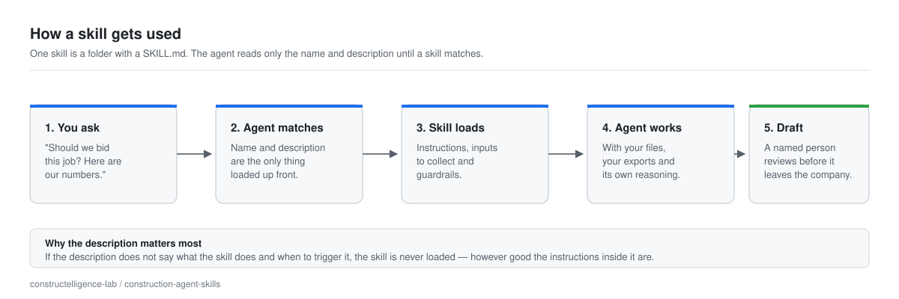
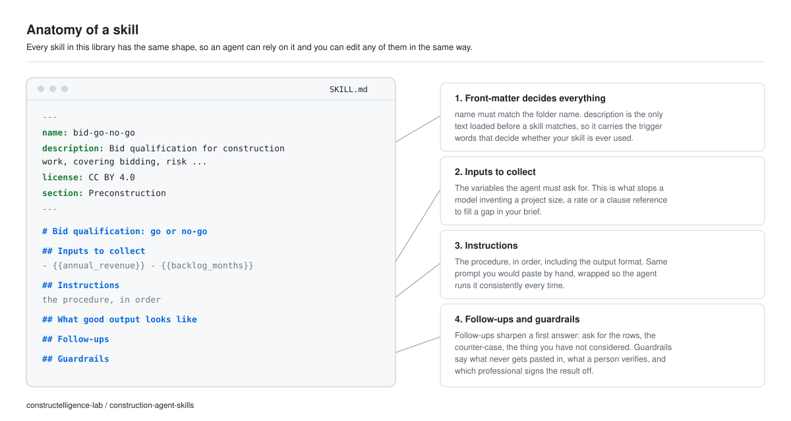
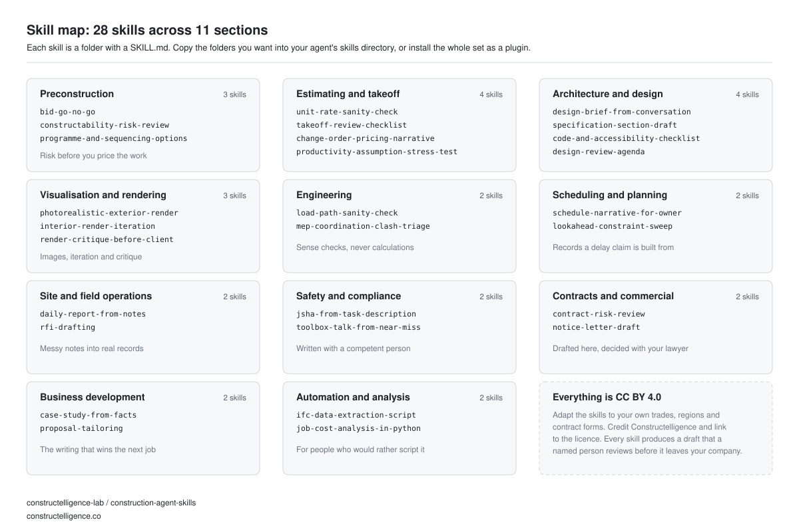

<h1 align="center">Construction agent skills</h1>

<p align="center"><strong>28 installable skills for Claude Code, Claude apps and any agent that reads a SKILL.md</strong></p>

<p align="center">Estimating · architecture · visualisation · engineering · scheduling · site operations · safety · commercial · business development</p>

<!-- begin:badge -->
   
<!-- end:badge -->

<p align="center"></p>

## Install

**Claude Code — as a plugin** (recommended: updates come with a pull):

```text
/plugin marketplace add constructelligence-lab/construction-agent-skills
/plugin install construction@construction-skills
```

**Claude Code — as plain skills**, if you would rather keep them in your own folder:

```bash
git clone https://github.com/constructelligence-lab/construction-agent-skills.git
mkdir -p ~/.claude/skills
cp -r construction-agent-skills/skills/* ~/.claude/skills/
```

Copy only the skills you want — each folder is independent, and nothing here needs a build step or a
dependency. For a project-scoped install, copy the same folders into `.claude/skills/` inside the
repository you are working in.

**Claude apps and other agents.** Zip the `skills/` folder and upload it wherever your tool accepts
skills, or point your agent at the `SKILL.md` files directly — the format is plain Markdown with
front-matter, so nothing here is tied to one vendor.

## What is in it

<!-- begin:index -->
### Preconstruction

*Qualifying work, framing the programme, finding risk before you price it.*

| Skill | What it does | Tags |
| --- | --- | --- |
| [`bid-go-no-go`](skills/bid-go-no-go/SKILL.md) | Bid qualification: go or no-go for construction and design work, covering bidding, risk, preconstruction. An invitation to bid lands and you need a defensible recommendation before you spend a week estimating it. Use when the user asks for help with bid qualification: go or no-go, or is working on bidding, risk, preconstruction in a construction, engineering or design context. Produces a reviewable draft, never a final answer. | `bidding` `risk` `preconstruction` |
| [`constructability-risk-review`](skills/constructability-risk-review/SKILL.md) | Constructability risk review of a drawing set for construction and design work, covering preconstruction, drawings, risk. You are pricing or planning a job and want a structured list of buildability questions before the bid goes in. Use when the user asks for help with constructability risk review of a drawing set, or is working on preconstruction, drawings, risk in a construction, engineering or design context. Produces a reviewable draft, never a final answer. | `preconstruction` `drawings` `risk` |
| [`programme-and-sequencing-options`](skills/programme-and-sequencing-options/SKILL.md) | Programme and sequencing options for construction and design work, covering preconstruction, programme, sequencing. You have a target completion date and a rough scope, and you want the plausible sequencing options on the table before you build a CPM schedule. Use when the user asks for help with programme and sequencing options, or is working on preconstruction, programme, sequencing in a construction, engineering or design context. Produces a reviewable draft, never a final answer. | `preconstruction` `programme` `sequencing` |

### Estimating and takeoff

*Sanity checks, pricing narratives and takeoff review.*

| Skill | What it does | Tags |
| --- | --- | --- |
| [`change-order-pricing-narrative`](skills/change-order-pricing-narrative/SKILL.md) | Change order pricing narrative for construction and design work, covering change-orders, commercial, pricing. The numbers are agreed internally and now need to be presented so they are hard to argue with — typically for a priced change that a client or a subcontractor will scrutinise. Use when the user asks for help with change order pricing narrative, or is working on change-orders, commercial, pricing in a construction, engineering or design context. Produces a reviewable draft, never a final answer. | `change-orders` `commercial` `pricing` |
| [`productivity-assumption-stress-test`](skills/productivity-assumption-stress-test/SKILL.md) | Productivity assumption stress test for construction and design work, covering productivity, labour, risk. An estimate depends on production rates you have assumed rather than measured, and you want to know how much of the margin is riding on them. Use when the user asks for help with productivity assumption stress test, or is working on productivity, labour, risk in a construction, engineering or design context. Produces a reviewable draft, never a final answer. | `productivity` `labour` `risk` |
| [`takeoff-review-checklist`](skills/takeoff-review-checklist/SKILL.md) | Takeoff review checklist for construction and design work, covering takeoff, quantities, quality. A takeoff has been produced — by a person, by software, or by one of the tools in our [open source construction tools](https://github.com/constructelligence-lab/open-source-construction-tools) list — and it needs a review that is actually systematic. Use when the user asks for help with takeoff review checklist, or is working on takeoff, quantities, quality in a construction, engineering or design context. Produces a reviewable draft, never a final answer. | `takeoff` `quantities` `quality` |
| [`unit-rate-sanity-check`](skills/unit-rate-sanity-check/SKILL.md) | Unit rate sanity check for construction and design work, covering estimating, pricing, review. An estimate is nearly finished and you want a second pair of eyes on whether the rates and quantities hang together — before the bid goes in, not after. Use when the user asks for help with unit rate sanity check, or is working on estimating, pricing, review in a construction, engineering or design context. Produces a reviewable draft, never a final answer. | `estimating` `pricing` `review` |

### Architecture and design

*Briefs, specifications, code topics and design review.*

| Skill | What it does | Tags |
| --- | --- | --- |
| [`code-and-accessibility-checklist`](skills/code-and-accessibility-checklist/SKILL.md) | Code and accessibility checklist for a design review for construction and design work, covering code, accessibility, compliance. You want a structured set of compliance questions to work through for a design, recognising that the model does not know your local code and must not be treated as knowing it. Use when the user asks for help with code and accessibility checklist for a design review, or is working on code, accessibility, compliance in a construction, engineering or design context. Produces a reviewable draft, never a final answer. | `code` `accessibility` `compliance` |
| [`design-brief-from-conversation`](skills/design-brief-from-conversation/SKILL.md) | Design brief from a client conversation for construction and design work, covering brief, client, architecture. You have come out of a client meeting with scattered notes and need a written brief that the client can confirm or correct before design work starts. Use when the user asks for help with design brief from a client conversation, or is working on brief, client, architecture in a construction, engineering or design context. Produces a reviewable draft, never a final answer. | `brief` `client` `architecture` |
| [`design-review-agenda`](skills/design-review-agenda/SKILL.md) | Design review agenda that finds problems for construction and design work, covering coordination, meetings, design. You are running a design or coordination review and want an agenda that surfaces conflicts rather than walking through the drawings in order. Use when the user asks for help with design review agenda that finds problems, or is working on coordination, meetings, design in a construction, engineering or design context. Produces a reviewable draft, never a final answer. | `coordination` `meetings` `design` |
| [`specification-section-draft`](skills/specification-section-draft/SKILL.md) | Specification section draft for construction and design work, covering specification, documentation, quality. You need a first draft of a specification section structure so you are editing rather than staring at an empty document — with the understanding that the technical content is yours, not the model's. Use when the user asks for help with specification section draft, or is working on specification, documentation, quality in a construction, engineering or design context. Produces a reviewable draft, never a final answer. | `specification` `documentation` `quality` |

### Visualisation and rendering

*Image prompts, iteration and critique before a client sees it.*

| Skill | What it does | Tags |
| --- | --- | --- |
| [`interior-render-iteration`](skills/interior-render-iteration/SKILL.md) | Interior render: iteration prompt for construction and design work, covering rendering, interior, iteration. The first interior image is close but wrong — the light, the proportions or the materials — and you want to change one thing at a time rather than regenerate from scratch. Use when the user asks for help with interior render: iteration prompt, or is working on rendering, interior, iteration in a construction, engineering or design context. Produces a reviewable draft, never a final answer. | `rendering` `interior` `iteration` |
| [`photorealistic-exterior-render`](skills/photorealistic-exterior-render/SKILL.md) | Photorealistic exterior render prompt for construction and design work, covering rendering, visualisation, marketing. You need a client-ready exterior visual quickly, before the model is advanced enough for a proper render, or to explore a façade direction. Use when the user asks for help with photorealistic exterior render prompt, or is working on rendering, visualisation, marketing in a construction, engineering or design context. Produces a reviewable draft, never a final answer. | `rendering` `visualisation` `marketing` |
| [`render-critique-before-client`](skills/render-critique-before-client/SKILL.md) | Render critique before it goes to the client for construction and design work, covering rendering, review, presentation. You are about to send a visual to a client and want a hard critique first — one that finds the things an architect, a planner or a contractor would spot immediately. Use when the user asks for help with render critique before it goes to the client, or is working on rendering, review, presentation in a construction, engineering or design context. Produces a reviewable draft, never a final answer. | `rendering` `review` `presentation` |

### Engineering

*Structural and MEP sense checks, with an engineer and never instead of one.*

| Skill | What it does | Tags |
| --- | --- | --- |
| [`load-path-sanity-check`](skills/load-path-sanity-check/SKILL.md) | Structural load path sanity check for construction and design work, covering structure, review, engineering. You are preparing for a coordination or value-engineering discussion and want the obvious load path and stability questions on the table. Use when the user asks for help with structural load path sanity check, or is working on structure, review, engineering in a construction, engineering or design context. Produces a reviewable draft, never a final answer. | `structure` `review` `engineering` |
| [`mep-coordination-clash-triage`](skills/mep-coordination-clash-triage/SKILL.md) | MEP coordination and clash triage for construction and design work, covering mep, coordination, bim. You have a clash report or a coordination problem list and need to decide which clashes matter, in what order to resolve them, and who should move. Use when the user asks for help with mep coordination and clash triage, or is working on mep, coordination, bim in a construction, engineering or design context. Produces a reviewable draft, never a final answer. | `mep` `coordination` `bim` |

### Scheduling and planning

*Narratives, look-aheads and the records a delay claim is built from.*

| Skill | What it does | Tags |
| --- | --- | --- |
| [`lookahead-constraint-sweep`](skills/lookahead-constraint-sweep/SKILL.md) | Three-week lookahead constraint sweep for construction and design work, covering lookahead, field, planning. You are building the next three-week lookahead and want to remove constraints before they stop work, rather than reporting them after the fact. Use when the user asks for help with three-week lookahead constraint sweep, or is working on lookahead, field, planning in a construction, engineering or design context. Produces a reviewable draft, never a final answer. | `lookahead` `field` `planning` |
| [`schedule-narrative-for-owner`](skills/schedule-narrative-for-owner/SKILL.md) | Schedule narrative for the owner for construction and design work, covering schedule, reporting, communication. The monthly schedule update is done and needs the narrative section: what moved, why, what you are doing about it, and what you need — without excuses and without jargon. Use when the user asks for help with schedule narrative for the owner, or is working on schedule, reporting, communication in a construction, engineering or design context. Produces a reviewable draft, never a final answer. | `schedule` `reporting` `communication` |

### Site and field operations

*Turning field notes into records somebody can act on.*

| Skill | What it does | Tags |
| --- | --- | --- |
| [`daily-report-from-notes`](skills/daily-report-from-notes/SKILL.md) | Daily report from messy field notes for construction and design work, covering field, records, daily-report. The day's notes are a mix of texts, voice-note reminders and scribbles, and the report needs to be written before you go home — with the facts intact and nothing invented. Use when the user asks for help with daily report from messy field notes, or is working on field, records, daily-report in a construction, engineering or design context. Produces a reviewable draft, never a final answer. | `field` `records` `daily-report` |
| [`rfi-drafting`](skills/rfi-drafting/SKILL.md) | RFI drafting that gets answered for construction and design work, covering rfi, documents, coordination. Something on site does not match the drawings and you need an RFI that is clear enough to be answered first time, with the schedule impact stated. Use when the user asks for help with rfi drafting that gets answered, or is working on rfi, documents, coordination in a construction, engineering or design context. Produces a reviewable draft, never a final answer. | `rfi` `documents` `coordination` |

### Safety and compliance

*Task-specific safety documents, written with a competent person.*

| Skill | What it does | Tags |
| --- | --- | --- |
| [`jsha-from-task-description`](skills/jsha-from-task-description/SKILL.md) | Job safety analysis from a task description for construction and design work, covering safety, jsha, field. You are preparing a task-specific safety analysis and want a structured first draft to edit with the crew, rather than starting from a template that says nothing about this job. Use when the user asks for help with job safety analysis from a task description, or is working on safety, jsha, field in a construction, engineering or design context. Produces a reviewable draft, never a final answer. | `safety` `jsha` `field` |
| [`toolbox-talk-from-near-miss`](skills/toolbox-talk-from-near-miss/SKILL.md) | Toolbox talk from a real near miss for construction and design work, covering safety, training, briefing. Something nearly went wrong on this site and you want a five-minute talk that lands with the crew, rather than a generic briefing they have heard ten times. Use when the user asks for help with toolbox talk from a real near miss, or is working on safety, training, briefing in a construction, engineering or design context. Produces a reviewable draft, never a final answer. | `safety` `training` `briefing` |

### Contracts and commercial

*Notices, risk reviews and payment narratives, drafted for review.*

| Skill | What it does | Tags |
| --- | --- | --- |
| [`contract-risk-review`](skills/contract-risk-review/SKILL.md) | Contract risk review preparation for construction and design work, covering contracts, risk, commercial. A contract or subcontract is on your desk and you want the risk topics organised before it goes to your lawyer, so the expensive hours are spent on judgement rather than on reading out loud. Use when the user asks for help with contract risk review preparation, or is working on contracts, risk, commercial in a construction, engineering or design context. Produces a reviewable draft, never a final answer. | `contracts` `risk` `commercial` |
| [`notice-letter-draft`](skills/notice-letter-draft/SKILL.md) | Notice letter draft for construction and design work, covering notices, claims, correspondence. An event has occurred and the contract requires written notice. Use when the user asks for help with notice letter draft, or is working on notices, claims, correspondence in a construction, engineering or design context. Produces a reviewable draft, never a final answer. | `notices` `claims` `correspondence` |

### Business development

*Case studies, proposals and the writing that wins the next job.*

| Skill | What it does | Tags |
| --- | --- | --- |
| [`case-study-from-facts`](skills/case-study-from-facts/SKILL.md) | Project case study from the facts for construction and design work, covering marketing, case-study, bd. You have finished a job worth writing about and need a case study for the website, a proposal or a prequalification pack — without inventing anything and without breaching confidentiality. Use when the user asks for help with project case study from the facts, or is working on marketing, case-study, bd in a construction, engineering or design context. Produces a reviewable draft, never a final answer. | `marketing` `case-study` `bd` |
| [`proposal-tailoring`](skills/proposal-tailoring/SKILL.md) | Tailoring a proposal to the client's actual concerns for construction and design work, covering proposals, bidding, bd. You have a standard proposal structure and a specific client, and you want the document to answer what *they* are worried about instead of repeating your company history. Use when the user asks for help with tailoring a proposal to the client's actual concerns, or is working on proposals, bidding, bd in a construction, engineering or design context. Produces a reviewable draft, never a final answer. | `proposals` `bidding` `bd` |

### Automation and analysis

*For the person who would rather script it than retype it.*

| Skill | What it does | Tags |
| --- | --- | --- |
| [`ifc-data-extraction-script`](skills/ifc-data-extraction-script/SKILL.md) | IFC data extraction script for construction and design work, covering ifc, bim, python, automation. You need a repeatable way to pull data out of IFC models — quantities, spaces, properties — instead of clicking through them, and you would rather review code than write the boilerplate. Use when the user asks for help with ifc data extraction script, or is working on ifc, bim, python, automation in a construction, engineering or design context. Produces a reviewable draft, never a final answer. | `ifc` `bim` `python` `automation` |
| [`job-cost-analysis-in-python`](skills/job-cost-analysis-in-python/SKILL.md) | Job cost analysis in Python or pandas for construction and design work, covering job-cost, python, analysis, automation. Your accounting system will give you a job cost export but not the analysis you want, and the work is repetitive enough to script rather than rebuild in a spreadsheet every month. Use when the user asks for help with job cost analysis in python or pandas, or is working on job-cost, python, analysis, automation in a construction, engineering or design context. Produces a reviewable draft, never a final answer. | `job-cost` `python` `analysis` `automation` |

<!-- end:index -->

## Anatomy of a skill

<p align="center"></p>

Every skill has the same five parts, so you can edit any of them without relearning the shape:

| Part | Why it is there |
| --- | --- |
| `name` and `description` in the front-matter | The `description` is the only text loaded before a skill matches, so it carries the trigger words. If it is vague, the skill is never used |
| **Inputs to collect** | The variables the agent must ask for, which is what stops it inventing a project size, a rate or a clause reference |
| **Instructions** | The procedure and the output format, in order |
| **What good output looks like** | How to tell a useful answer from a fluent one |
| **Follow-ups** and **Guardrails** | How to sharpen the answer, what never gets pasted in, and which professional signs it off |

## Coverage

<p align="center"></p>

## How this library was built

The skills were generated from the
[construction prompts library](https://github.com/constructelligence-lab/construction-prompts) and then
given skill front-matter, input lists and guardrails. That keeps one source of truth for the instructions
and makes it cheap to keep both libraries in step:

```bash
python3 scripts/import_prompts.py --source ../construction-prompts/prompts   # regenerate skills
python3 scripts/build_index.py                                              # rebuild the index and badge
python3 scripts/validate.py                                                 # check them
```

CI runs the build and the validator on every push, and fails if the index in this README has drifted from
the files — so the tables above cannot quietly go stale.

## Ground rules

- **A person owns every output.** These skills produce drafts. Nothing goes to a client, an owner, a
  subcontractor or a regulator without a named reviewer.
- **Never paste** contracts under negotiation, pricing or bid strategy, personal or medical data,
  anything under an NDA, or anything a client has asked you to protect.
- **Verify anything factual** — quantities, dates, clause references, code sections and figures — against
  the source document.
- **Use a business tier** with terms that exclude your data from model training, and a written company rule
  on what may be pasted. Skills do not change what your AI tool does with your data; your tool's terms do.
- **Professional work stays professional.** Structural and MEP skills are sense checks, not calculations.
  Safety skills are written with a competent person. Commercial skills are drafted for your lawyer to
  review, not instead of it.

## Contributing

Add a folder under `skills/<name>/SKILL.md`, then run the build and the validator. A useful skill says
where it came from — a real job, a real failure mode — and what it is bad at. Skills that only sound
impressive do not belong here.

## Licence

**CC BY 4.0.** Adapt them for your trades, regions, contract forms and house style, and use them
commercially. Credit Constructelligence and link to the licence.

---

*Maintained by [Constructelligence](https://constructelligence.co) — building the AI infrastructure for
construction.*
